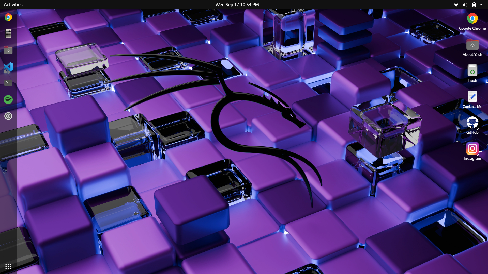

#  UbuntuOS Simulation – Portfolio

Welcome to my interactive **portfolio website** built in the style of **Ubuntu 20.04 Desktop**.  
It’s a **Next.js + TailwindCSS** project where you can explore apps, wallpapers, and menus just like an actual Ubuntu OS — but inside your browser.

 **Live Demo**: [Click here](https://yashsarkar-portfolio.vercel.app/)  
<a href="https://buymeacoffee.com/yashsarkar" target="_blank"></a>
---

##  Features

-  Ubuntu-style **desktop environment** (lock screen, navbar, side bar, applications menu)  
-  **Interactive apps**: terminal, calculator, text editor, chrome, Spotify, VS Code, Todoist, Trash, etc.  
-  **Custom themes & wallpapers** available in `/public/themes` and `/public/wallpapers`  
-  Integrated **resume viewer** (`public/files/Yash-resume.pdf`)  
-  Contact form powered by **EmailJS**  
-  Built with **Next.js** and styled using **Tailwind CSS**

---

## 🚀 Getting Started

Clone the repository:

```bash
git clone https://github.com/yashsarkar164/YashPortfolio.git
cd YashPortfolio

```
Install dependencies:
```bash
npm install
```
Run development server:
```bash
npm run dev
```

The site will run at (http://localhost:3000)

🛠️ Build & Deployment

Build production files:
```bash
npm run build
npm run export
```
All static files will be generated in the `out/` folder.
This project is automatically deployed to GitHub Pages using GitHub Actions:
Workflow file: `.github/workflows/gh-deploy.yml`
Deployment branch: `gh-pages`


## Contact Form Setup

This project uses [EmailJS](https://www.emailjs.com/) for handling contact forms.

**1.** Create an account in **EmailJS**.
**2.** Add a new service (Gmail / Outlook recommended).
**3.** Copy the **Service ID**, **Template ID**, and **User ID**.
**4.** Add them to a `.env.local` file at the project root:

```bash
NEXT_PUBLIC_USER_ID=your_user_id
NEXT_PUBLIC_TEMPLATE_ID=your_template_id
NEXT_PUBLIC_SERVICE_ID=your_service_id
```

# OVERVIEW

##  Desktop



## Contributing

    Contributions are always welcome!
    If you’d like to add new features or improve the design:

**1.** Fork the repo
**2.** Create your branch: `git checkout -b feature/AmazingFeature`
**3.** Commit changes: `git commit -m "Add AmazingFeature"`
**4.** Push: `git push origin feature/AmazingFeature`
**5.** Open a Pull Request

## ☕ Support

If you like this project, you can support me here:
<a href="https://buymeacoffee.com/yashsarkar" target="_blank"></a>